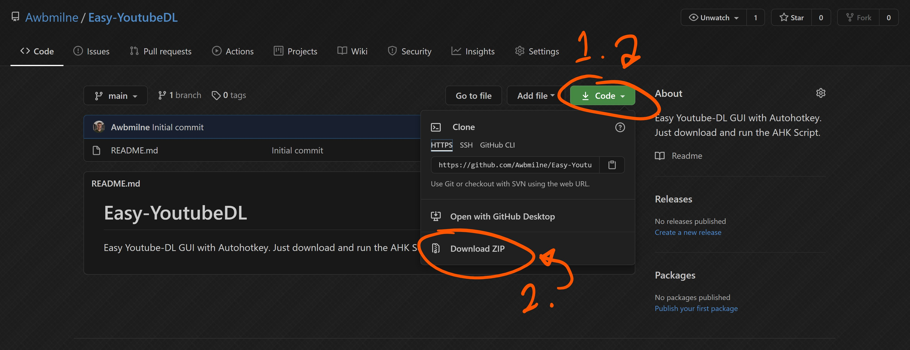
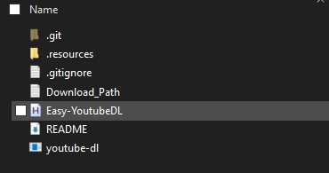

# Easy-YoutubeDL
Easy Youtube-DL GUI with Autohotkey. Just download and run the AHK Script.

## Install
1. Make sure you have AutoHotkey Installed on your system. If you dont, [Download it here](https://www.autohotkey.com/download/)
2. Make sure you have FFMPEG installed on your system
   1. [Download it here](https://www.gyan.dev/ffmpeg/builds/)
   2. Add ffmpeg `bin` folder to you path
   3. ─ OR ─ Try running `choco install ffmpeg` in an administrator command prompt
3. Download the files for this repo.
   - A | Use `git clone`
       ```bash
       git clone https://github.com/Awbmilne/Easy-YoutubeDL.git
       ```
   - B | Use the "Download ZIP" in the `Code` Menu above
       

4. Place all the files in the folder wherever you want, This can be your documents folder, your desktop... Doesnt matter. (*The Only files that really matter are the AHK file, the download path file, and the YoutubeDL.exe file*)

## Usage
1. Double Click the `Easy-YoutubeDL.ahk` file to run the script.\
    

2. The Script is now running (You may get a notifcation saying so). Now that it is running, you can use the keyboard shortcuts:
    - `Win + Alt + Y` Opens the YoutubeDL Download GUI. Easy to use. You can paste multiple URLs so that it automatically starts the next download after the previous.
        ```text
        https://youtube.com/video_1_url
        - or -
        https://youtube.com/video_1_url, https://youtube.com/video_2_url, https://youtube.com/video_3_url
        ```
    - `Win + Alt + Esc` To stop the script. You can also Right Click the Autohotkey track icon to stop the script.\
        

## Customization
If you want to change the download path for the Script... Open the `Download_Path.txt` file and replace `.\Downloaded_Videos` with the path to whatever folder you want. The most common use case is to use your downloads Folder.\
\
***Download_Path.txt***
```text
C:\Users\Person\Downloads
```

## The Full Install Process

